# Markdown 语法全面测试文档

这是一个用于测试 Markdown 渲染引擎的综合性测试文件，包含了所有标准的 Markdown 语法元素、扩展语法、代码块、数学公式和各种嵌入式内容。

## 1. 基础文本格式化

### 1.1 标题级别
# 一级标题
## 二级标题
### 三级标题
#### 四级标题
##### 五级标题
###### 六级标题

### 1.2 强调和斜体
这是**粗体文本**，这是*斜体文本*，这是***粗斜体文本***，这是~~删除线文本~~。

### 1.3 下划线和高亮
这是<u>下划线文本</u>，这是==高亮文本==。

## 2. 列表

### 2.1 无序列表
- 第一项
- 第二项
  - 嵌套项
  - 另一个嵌套项
- 第三项
  * 使用星号
  + 使用加号

### 2.2 有序列表
1. 第一项
2. 第二项
   1. 嵌套第一项
   2. 嵌套第二项
3. 第三项

### 2.3 任务列表
- [ ] 未完成任务
- [x] 已完成任务
- [ ] 另一个任务
  - [x] 嵌套的已完成任务

### 2.4 定义列表
Markdown
: 一种轻量级标记语言

Git
: 分布式版本控制系统

VSCode
: 跨平台代码编辑器

## 3. 链接和引用

### 3.1 链接
[内联链接](https://example.com)
[带标题的链接](https://example.com "示例网站")
[引用链接][1]
[相对链接](../docs/README.md)

[1]: https://example.com "参考链接示例"

### 3.2 自动链接
<https://example.com>
<contact@example.com>

### 3.3 脚注
这是一个带有脚注的句子。[1](@ref)另一个引用。[2](@ref)

[1](@ref): 这是第一个脚注的内容，可以包含多行文本。
[2](@ref): 第二个脚注，也可以包含**格式化的文本**。

## 4. 图片和多媒体

### 4.1 图片


### 4.2 带链接的图片
[](https://example.com)

## 5. 代码

### 5.1 行内代码
在段落中使用`inline code`，比如`print("Hello World")`。

### 5.2 代码块

```python
Python代码示例
import math
from typing import List, Optional
def fibonacci(n: int) -> List[int]:
"""
生成斐波那契数列
"""
if n <= 0:
return []
elif n == 1:
return [0]
sequence = [0, 1]
for i in range(2, n):
    sequence.append(sequence[i-1] + sequence[i-2])

return sequence
class DataPoint:
"""数据点类"""
def init(self, x: float, y: float, label: Optional[str] = None):
self.x = x
self.y = y
self.label = label
def distance_to(self, other: 'DataPoint') -> float:
    return math.sqrt((self.x - other.x)**2 + (self.y - other.y)**2)

def __repr__(self) -> str:
    return f"DataPoint({self.x}, {self.y}, label={self.label})"
使用示例
if name== "main":
points = [DataPoint(i, i**2, f"p{i}") for i in range(5)]
print(f"Points: {points}")
print(f"Fibonacci: {fibonacci(10)}")
```
```cpp
// C++代码示例
include <iostream>
include <vector>
include <memory>
include <cmath>
namespace Geometry {
class Point {
private:
    double x, y;
    
public:
    Point(double x = 0.0, double y = 0.0) : x(x), y(y) {}
    
    double distanceTo(const Point& other) const {
        return std::sqrt(std::pow(x - other.x, 2) + std::pow(y - other.y, 2));
    }
    
    double getX() const { return x; }
    double getY() const { return y; }
    
    void setX(double newX) { x = newX; }
    void setY(double newY) { y = newY; }
    
    virtual std::string toString() const {
        return "Point(" + std::to_string(x) + ", " + std::to_string(y) + ")";
    }
};

class Shape {
public:
    virtual double area() const = 0;
    virtual double perimeter() const = 0;
    virtual ~Shape() = default;
};

class Circle : public Shape {
private:
    Point center;
    double radius;
    
public:
    Circle(const Point& center, double radius) 
        : center(center), radius(radius) {
        if (radius < 0) {
            throw std::invalid_argument("Radius cannot be negative");
        }
    }
    
    double area() const override {
        return M_PI * radius * radius;
    }
    
    double perimeter() const override {
        return 2 * M_PI * radius;
    }
};
}
int main() {
using Geometry::Point;
using Geometry::Circle;
Point p1(1.0, 2.0);
Point p2(4.0, 6.0);

std::cout << "Distance: " << p1.distanceTo(p2) << std::endl;

Circle c(p1, 5.0);
std::cout << "Circle area: " << c.area() << std::endl;
std::cout << "Circle perimeter: " << c.perimeter() << std::endl;

return 0;
}
```

```rust
// Rust代码示例
use std::fmt;
use std::error::Error;
[derive(Debug, Clone, PartialEq)]
pub enum HttpStatus {
Ok = 200,
NotFound = 404,
InternalServerError = 500,
}
impl HttpStatus {
pub fn from_code(code: u16) -> Option<Self> {
match code {
200 => Some(HttpStatus::Ok),
404 => Some(HttpStatus::NotFound),
500 => Some(HttpStatus::InternalServerError),
_ => None,
}
}
pub fn reason_phrase(&self) -> &'static str {
    match self {
        HttpStatus::Ok => "OK",
        HttpStatus::NotFound => "Not Found",
        HttpStatus::InternalServerError => "Internal Server Error",
    }
}
}
[derive(Debug)]
pub struct HttpResponse {
status: HttpStatus,
headers: Vec<(String, String)>,
body: Option<String>,
}
impl HttpResponse {
pub fn new(status: HttpStatus) -> Self {
Self {
status,
headers: Vec::new(),
body: None,
}
}
pub fn with_body(mut self, body: String) -> Self {
    self.body = Some(body);
    self
}

pub fn add_header(mut self, key: &str, value: &str) -> Self {
    self.headers.push((key.to_string(), value.to_string()));
    self
}

pub fn to_string(&self) -> String {
    let mut response = format!(
        "HTTP/1.1 {} {}\r\n",
        self.status as u16,
        self.status.reason_phrase()
    );
    
    for (key, value) in &self.headers {
        response.push_str(&format!("{}: {}\r\n", key, value));
    }
    
    if let Some(body) = &self.body {
        response.push_str(&format!("Content-Length: {}\r\n", body.len()));
        response.push_str("\r\n");
        response.push_str(body);
    } else {
        response.push_str("\r\n");
    }
    
    response
}
}
fn process_request() -> Result<HttpResponse, Box<dyn Error>> {
let response = HttpResponse::new(HttpStatus::Ok)
.with_body("{"message": "Hello, World!"}".to_string())
.add_header("Content-Type", "application/json");
Ok(response)
}
fn main() {
match process_request() {
Ok(response) => println!("Response:\n{}", response.to_string()),
Err(e) => eprintln!("Error: {}", e),
}
}
```

```c
// C代码示例
include <stdio.h>
include <stdlib.h>
include <string.h>
include <math.h>
define MAX_STRING_LEN 256
define PI 3.14159265358979323846
typedef struct {
double x;
double y;
} Point;
typedef struct {
Point center;
double radius;
} Circle;
typedef struct {
Point vertices[3];
} Triangle;
double distance(Point a, Point b) {
return sqrt(pow(a.x - b.x, 2) + pow(a.y - b.y, 2));
}
double circle_area(Circle c) {
return PI * c.radius * c.radius;
}
double circle_circumference(Circle c) {
return 2 * PI * c.radius;
}
double triangle_area(Triangle t) {
double a = distance(t.vertices[0], t.vertices[1]);
double b = distance(t.vertices[1], t.vertices[2]);
double c = distance(t.vertices[2], t.vertices[0]);
double s = (a + b + c) / 2.0;
if (s <= a || s <= b || s <= c) {
    return 0.0;
}

return sqrt(s * (s - a) * (s - b) * (s - c));
}
void process_string(const char* input, char* output) {
int len = strlen(input);
int j = 0;
for (int i = 0; i < len; i++) {
    if ((input[i] >= 'a' && input[i] <= 'z') || 
        (input[i] >= 'A' && input[i] <= 'Z') ||
        (input[i] >= '0' && input[i] <= '9') ||
        input[i] == ' ') {
        output[j++] = input[i];
    }
}
output[j] = '\0';
}
int main() {
Point p1 = {0.0, 0.0};
Point p2 = {3.0, 4.0};
printf("Distance between points: %.2f\n", distance(p1, p2));

Circle c = {p1, 5.0};
printf("Circle area: %.2f\n", circle_area(c));
printf("Circle circumference: %.2f\n", circle_circumference(c));

Triangle t = {{{0.0, 0.0}, {4.0, 0.0}, {0.0, 3.0}}};
printf("Triangle area: %.2f\n", triangle_area(t));

char input[] = "Hello, World! 123";
char output[MAX_STRING_LEN];

process_string(input, output);
printf("Filtered string: %s\n", output);

return 0;
}
```

```bash
!/bin/bash
Bash脚本示例
这是一个多功能的系统信息脚本
set -euo pipefail
颜色定义
RED='\033[0;31m'
GREEN='\033[0;32m'
YELLOW='\033[1;33m'
BLUE='\033[0;34m'
NC='\033[0m' # No Color
日志函数
log_info() {
echo -e "BLUE[INFO]{NC} $1"
}
log_success() {
echo -e "GREEN[SUCCESS]{NC} $1"
}
log_warning() {
echo -e "YELLOW[WARNING]{NC} $1"
}
log_error() {
echo -e "RED[ERROR]{NC} $1" >&2
}
系统信息收集
get_system_info() {
log_info "收集系统信息..."
local os_info
if [[ -f /etc/os-release ]]; then
    os_info=$(grep PRETTY_NAME /etc/os-release | cut -d= -f2 | tr -d '"')
elif [[ $(uname) == "Darwin" ]]; then
    os_info=$(sw_vers -productName)
else
    os_info=$(uname -s)
fi

local kernel_version=$(uname -r)
local arch=$(uname -m)
local hostname=$(hostname)
local uptime=$(uptime -p 2>/dev/null || uptime)

echo "操作系统: $os_info"
echo "内核版本: $kernel_version"
echo "系统架构: $arch"
echo "主机名称: $hostname"
echo "运行时间: $uptime"
}
```

```lua
-- Lua代码示例
-- 简单的配置解析器
local M = {}
M.default_config = {
port = 8080,
host = "127.0.0.1",
timeout = 30,
max_connections = 100,
debug = false,
log_level = "info"
}
function M.parse_config(filename)
local config = {}
-- 设置默认值
for k, v in pairs(M.default_config) do
    config[k] = v
end

local file = io.open(filename, "r")
if not file then
    return config
end

for line in file:lines() do
    -- 移除注释
    local clean_line = line:match("^([^#]+)") or line
    clean_line = clean_line:match("^%s*(.-)%s*$")  -- 去除首尾空白
    
    if #clean_line > 0 then
        local key, value = clean_line:match("^([%w_]+)%s*=%s*(.+)$")
        if key and value then
            -- 转换值类型
            if value == "true" then
                config[key] = true
            elseif value == "false" then
                config[key] = false
            elseif tonumber(value) then
                config[key] = tonumber(value)
            else
                -- 移除字符串引号
                config[key] = value:gsub("^['\"](.*)['\"]$", "%1")
            end
        end
    end
end

file:close()
return config
end
function M.validate_config(config)
local required_fields = {"port", "host"}
for _, field in ipairs(required_fields) do
    if config[field] == nil then
        return false, string.format("Missing required field: %s", field)
    end
end

if type(config.port) ~= "number" or config.port < 1 or config.port > 65535 then
    return false, "Port must be a number between 1 and 65535"
end

if type(config.max_connections) ~= "number" or config.max_connections < 1 then
    return false, "max_connections must be a positive number"
end

return true
end
function M.print_config(config)
print("Current configuration:")
print(string.rep("-", 40))
local keys = {}
for k in pairs(config) do
    table.insert(keys, k)
end
table.sort(keys)

for _, key in ipairs(keys) do
    print(string.format("%-20s = %s", key, tostring(config[key])))
end
print(string.rep("-", 40))
end
-- 使用示例
if arg and arg[1] then
local config = M.parse_config(arg[1])
local valid, err = M.validate_config(config)
if valid then
    M.print_config(config)
else
    print("Configuration error:", err)
end
end
return M
```

## 6. 表格

### 6.1 基本表格
| 姓名 | 年龄 | 职业 |
|------|------|------|
| 张三 | 25  | 工程师 |
| 李四 | 30  | 设计师 |
| 王五 | 28  | 产品经理 |

### 6.2 对齐表格
| 左对齐 | 居中对齐 | 右对齐 |
|:-------|:--------:|-------:|
| 左对齐文本 | 居中文本 | 右对齐文本 |
| 另一行 | 更多内容 | 数字123 |

### 6.3 复杂表格
| 项目 | 描述 | 状态 | 优先级 | 完成日期 |
|------|------|------|--------|----------|
| 功能A | 实现用户登录 | ✅ 完成 | 高 | 2024-01-15 |
| 功能B | 添加支付功能 | 🔄 进行中 | 中 | 2024-02-01 |
| 功能C | 优化性能 | ⏳ 待开始 | 高 | 2024-02-15 |
| 功能D | 文档编写 | ❌ 取消 | 低 | - |

## 7. 引用块

### 7.1 基本引用
> 这是一个引用块。
> 可以包含多行文本。

### 7.2 嵌套引用
> 第一层引用
>> 第二层引用
>>> 第三层引用
>
> 回到第一层

### 7.3 包含其他元素的引用
> ## 引用中的标题
> 
> 引用中的**加粗文本**和`行内代码`
> 
> 1. 引用中的列表
> 2. 第二项
> 
> | 表格 | 示例 |
> |------|------|
> | 单元格1 | 单元格2 |

## 8. 水平分割线

### 8.1 各种分割线写法
---

***

*****

- - -

---

## 9. 数学公式

### 9.1 行内数学公式
这是行内公式：$E = mc^2$，以及$\int_a^b f(x) dx = F(b) - F(a)$。

### 9.2 块级数学公式
#### 麦克斯韦方程组
$$
\begin{aligned}
\nabla \cdot \mathbf{E} &= \frac{\rho}{\varepsilon_0} \\
\nabla \cdot \mathbf{B} &= 0 \\
\nabla \times \mathbf{E} &= -\frac{\partial \mathbf{B}}{\partial t} \\
\nabla \times \mathbf{B} &= \mu_0 \mathbf{J} + \mu_0 \varepsilon_0 \frac{\partial \mathbf{E}}{\partial t}
\end{aligned}
$$

#### 薛定谔方程
$$
i\hbar \frac{\partial}{\partial t} \Psi(\mathbf{r}, t) = \hat{H} \Psi(\mathbf{r}, t)
$$

其中：

$$
\hat{H} = -\frac{\hbar^2}{2m} \nabla^2 + V(\mathbf{r})
$$

#### 欧拉公式
$$
e^{i\theta} = \cos\theta + i\sin\theta
$$

#### 质能方程
$$
E = \sqrt{(pc)^2 + (m_0c^2)^2}
$$

## 10. Mermaid 图表

### 10.1 流程图

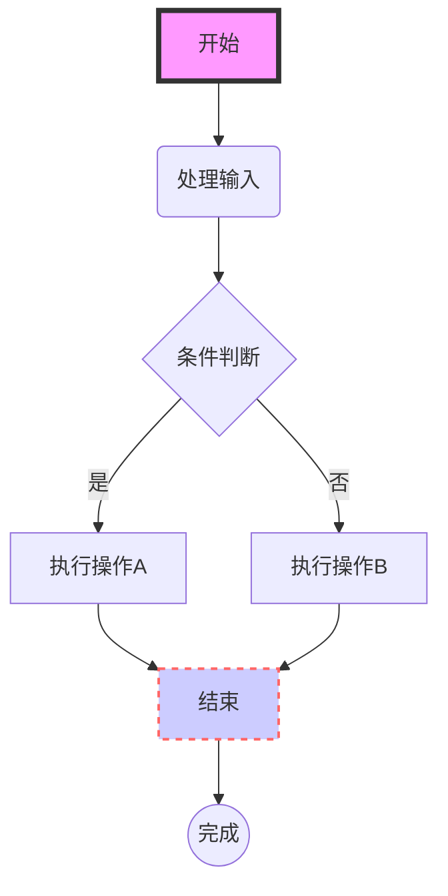
```mermaid
graph TD
A[开始] --> B(处理输入)
B --> C{条件判断}
C -->|是| D[执行操作A]
C -->|否| E[执行操作B]
D --> F[结束]
E --> F
F --> G((完成))
style A fill:#f9f,stroke:#333,stroke-width:4px
style F fill:#ccf,stroke:#f66,stroke-width:2px,stroke-dasharray:5 5
```

### 10.2 时序图

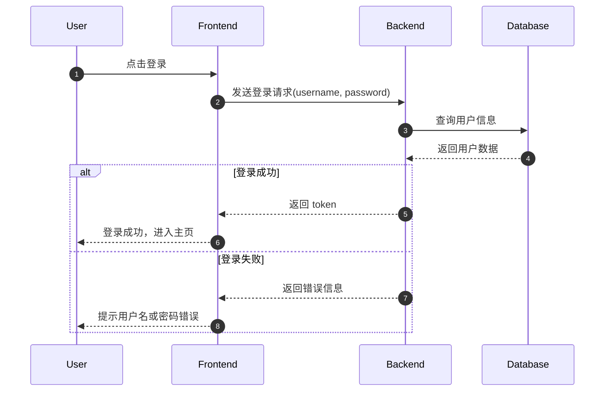
```mermaid

sequenceDiagram
    autonumber
    participant U as User
    participant F as Frontend
    participant B as Backend
    participant D as Database

    U->>F: 点击登录
    F->>B: 发送登录请求(username, password)
    B->>D: 查询用户信息
    D-->>B: 返回用户数据
    alt 登录成功
        B-->>F: 返回 token
        F-->>U: 登录成功，进入主页
    else 登录失败
        B-->>F: 返回错误信息
        F-->>U: 提示用户名或密码错误
    end

```

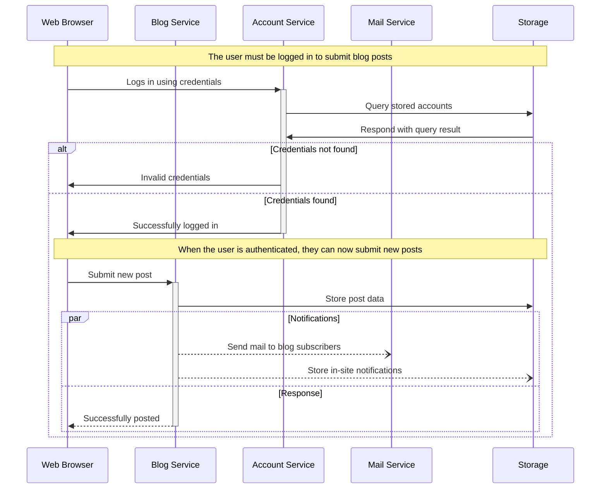
```mermaid
sequenceDiagram
    participant web as Web Browser
    participant blog as Blog Service
    participant account as Account Service
    participant mail as Mail Service
    participant db as Storage

    Note over web,db: The user must be logged in to submit blog posts
    web->>+account: Logs in using credentials
    account->>db: Query stored accounts
    db->>account: Respond with query result

    alt Credentials not found
        account->>web: Invalid credentials
    else Credentials found
        account->>-web: Successfully logged in

        Note over web,db: When the user is authenticated, they can now submit new posts
        web->>+blog: Submit new post
        blog->>db: Store post data

        par Notifications
            blog--)mail: Send mail to blog subscribers
            blog--)db: Store in-site notifications
        and Response
            blog-->>-web: Successfully posted
        end
    end

```

### 10.3 类图

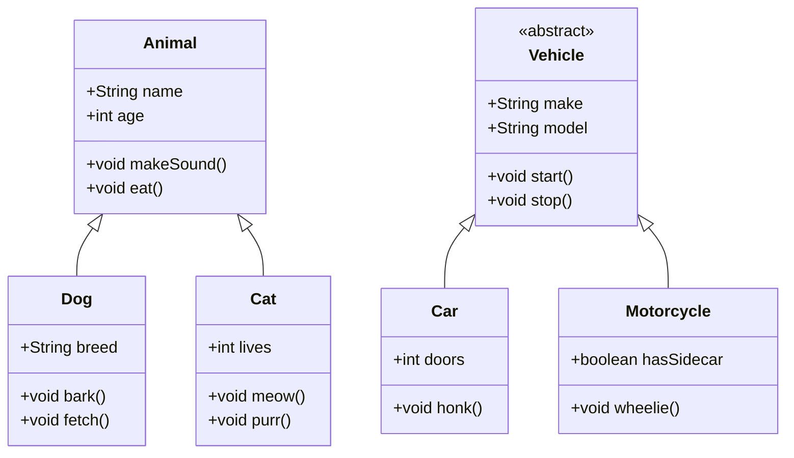
```mermaid
classDiagram
class Animal {
+String name
+int age
+void makeSound()
+void eat()
}
class Dog {
    +String breed
    +void bark()
    +void fetch()
}

class Cat {
    +int lives
    +void meow()
    +void purr()
}

Animal <|-- Dog
Animal <|-- Cat

class Vehicle {
    <<abstract>>
    +String make
    +String model
    +void start()
    +void stop()
}

class Car {
    +int doors
    +void honk()
}

class Motorcycle {
    +boolean hasSidecar
    +void wheelie()
}

Vehicle <|-- Car
Vehicle <|-- Motorcycle
```

### 10.4 状态图

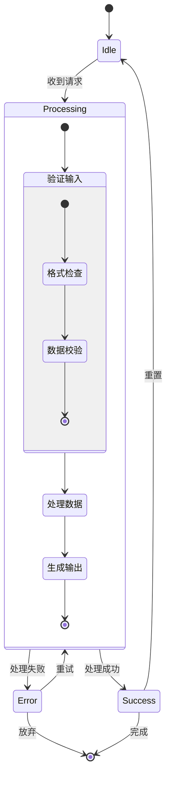
```mermaid
stateDiagram-v2
[*] --> Idle
Idle --> Processing : 收到请求
Processing --> Success : 处理成功
Processing --> Error : 处理失败
Error --> Processing : 重试
Error --> [*] : 放弃
Success --> Idle : 重置
Success --> [*] : 完成
state Processing {
    [*] --> 验证输入
    验证输入 --> 处理数据
    处理数据 --> 生成输出
    生成输出 --> [*]
    
    state 验证输入 {
        [*] --> 格式检查
        格式检查 --> 数据校验
        数据校验 --> [*]
    }
}
```

### 10.5 甘特图

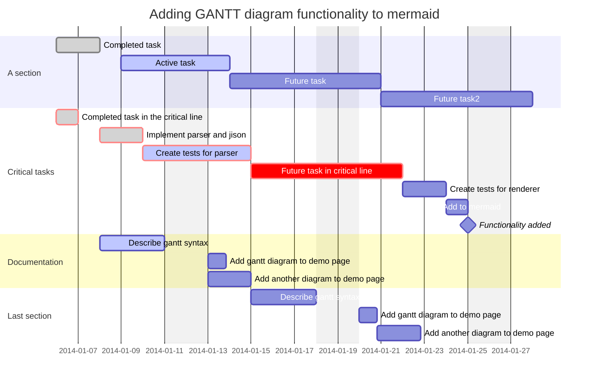
```mermaid
gantt
    dateFormat  YYYY-MM-DD
    title       Adding GANTT diagram functionality to mermaid
    excludes    weekends
    %% (`excludes` accepts specific dates in YYYY-MM-DD format, days of the week ("sunday") or "weekends", but not the word "weekdays".)

    section A section
    Completed task            :done,    des1, 2014-01-06,2014-01-08
    Active task               :active,  des2, 2014-01-09, 3d
    Future task               :         des3, after des2, 5d
    Future task2              :         des4, after des3, 5d

    section Critical tasks
    Completed task in the critical line :crit, done, 2014-01-06,24h
    Implement parser and jison          :crit, done, after des1, 2d
    Create tests for parser             :crit, active, 3d
    Future task in critical line        :crit, 5d
    Create tests for renderer           :2d
    Add to mermaid                      :until isadded
    Functionality added                 :milestone, isadded, 2014-01-25, 0d

    section Documentation
    Describe gantt syntax               :active, a1, after des1, 3d
    Add gantt diagram to demo page      :after a1  , 20h
    Add another diagram to demo page    :doc1, after a1  , 48h

    section Last section
    Describe gantt syntax               :after doc1, 3d
    Add gantt diagram to demo page      :20h
    Add another diagram to demo page    :48h

```

### 10.7 用户旅程图

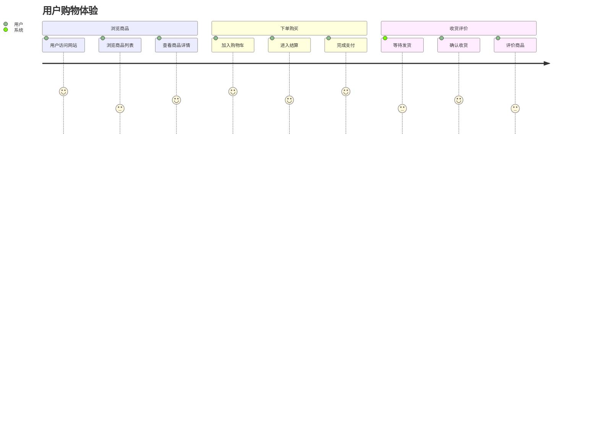
```mermaid
journey
title 用户购物体验
section 浏览商品
用户访问网站: 5: 用户
浏览商品列表: 3: 用户
查看商品详情: 4: 用户
section 下单购买
加入购物车: 5: 用户
进入结算: 4: 用户
完成支付: 5: 用户
section 收货评价
等待发货: 3: 系统
确认收货: 4: 用户
评价商品: 3: 用户
```

### 10.8 象限图


```mermaid
quadrantChart
    title Reach and engagement of campaigns
    x-axis Low Reach --> High Reach
    y-axis Low Engagement --> High Engagement
    quadrant-1 We should expand
    quadrant-2 Need to promote
    quadrant-3 Re-evaluate
    quadrant-4 May be improved
    Campaign A: [0.3, 0.6]
    Campaign B: [0.45, 0.23]
    Campaign C: [0.57, 0.69]
    Campaign D: [0.78, 0.34]
    Campaign E: [0.40, 0.34]
    Campaign F: [0.35, 0.78]

```

### 10.9 实体关系图

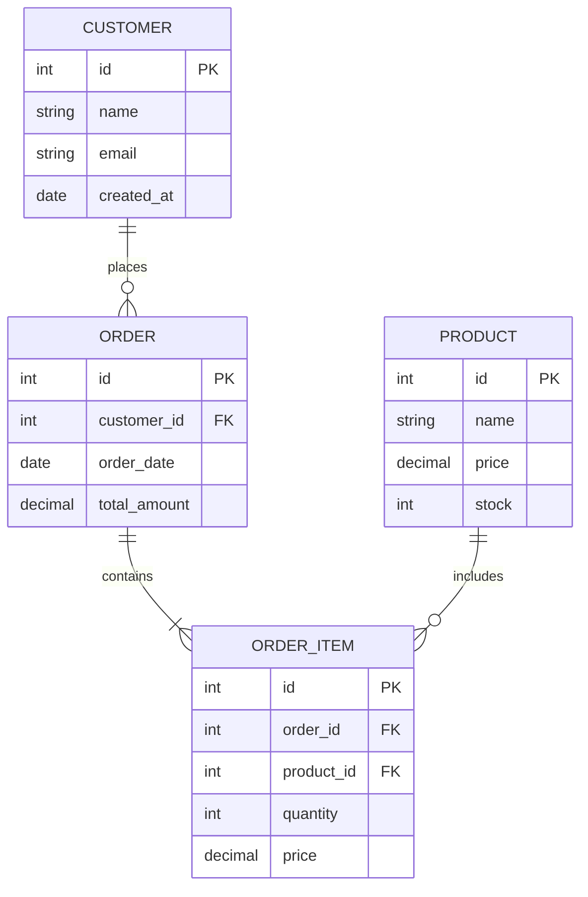
```mermaid
erDiagram
CUSTOMER ||--o{ ORDER : places
ORDER ||--|{ ORDER_ITEM : contains
PRODUCT ||--o{ ORDER_ITEM : includes
CUSTOMER {
int id PK
string name
string email
date created_at
}
ORDER {
int id PK
int customer_id FK
date order_date
decimal total_amount
}
ORDER_ITEM {
int id PK
int order_id FK
int product_id FK
int quantity
decimal price
}
PRODUCT {
int id PK
string name
decimal price
int stock
}
```

### 10.10 思维导图

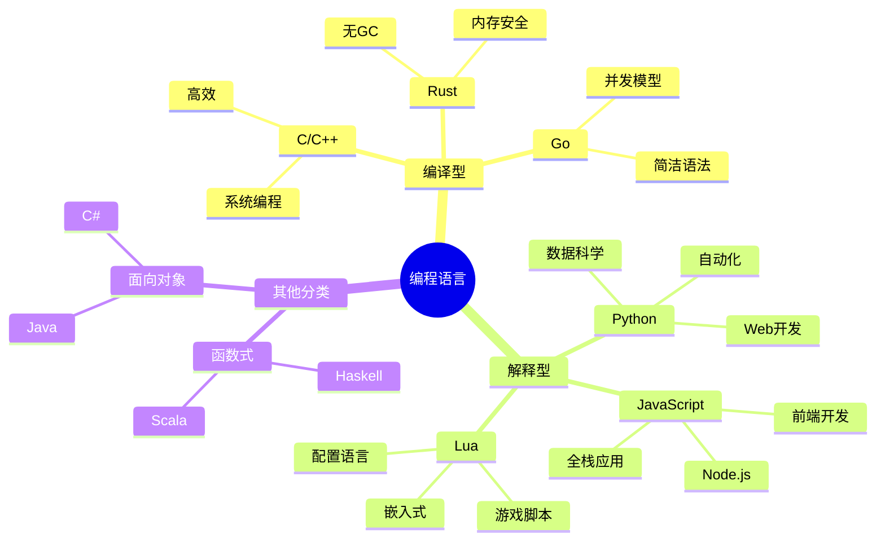
```mermaid
mindmap
  root((编程语言))
    编译型
      C/C++
        高效
        系统编程
      Rust
        内存安全
        无GC
      Go
        并发模型
        简洁语法
    解释型
      Python
        数据科学
        Web开发
        自动化
      JavaScript
        前端开发
        Node.js
        全栈应用
      Lua
        游戏脚本
        嵌入式
        配置语言
    其他分类
      函数式
        Haskell
        Scala
      面向对象
        Java
        C#
```

### 10.11 饼图

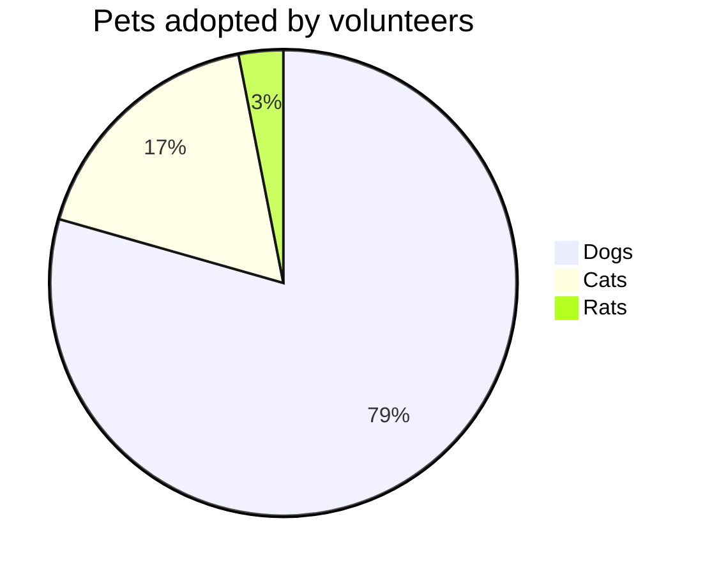
```mermaid

pie title Pets adopted by volunteers
    "Dogs" : 386
    "Cats" : 85
    "Rats" : 15
```

### 10.12 雷达图

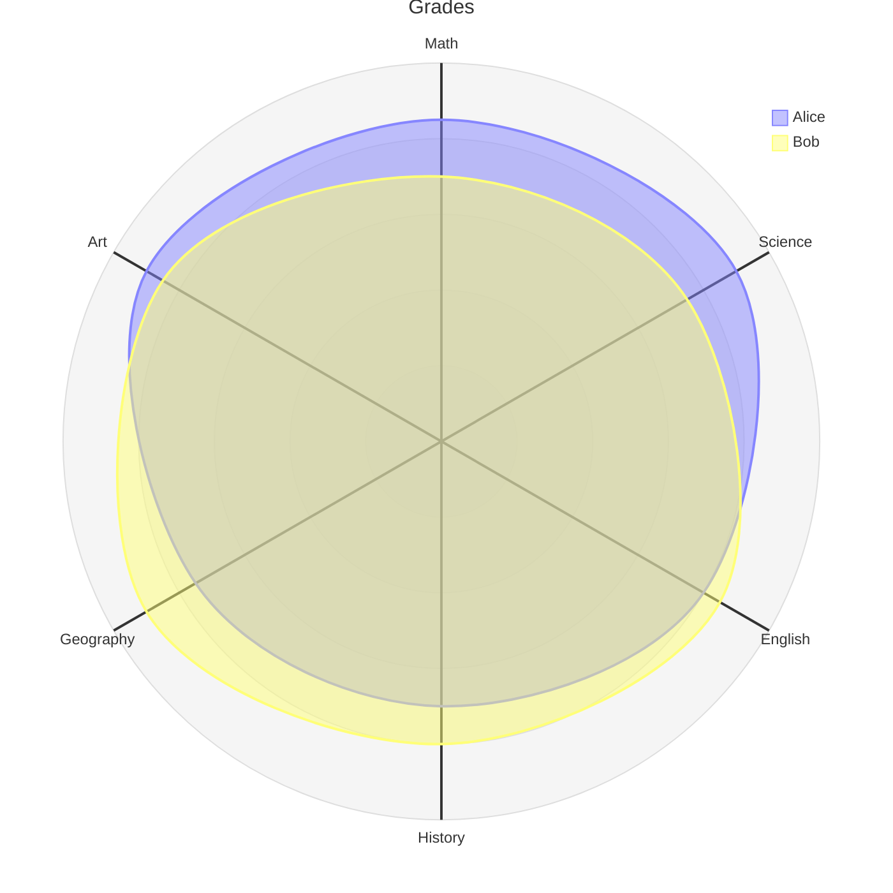
```mermaid
---
title: "Grades"
---
radar-beta
  axis m["Math"], s["Science"], e["English"]
  axis h["History"], g["Geography"], a["Art"]
  curve a["Alice"]{85, 90, 80, 70, 75, 90}
  curve b["Bob"]{70, 75, 85, 80, 90, 85}

  max 100
  min 0

```

### 10.13 TreeMap

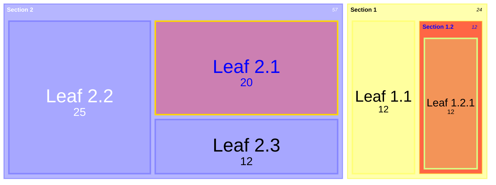
```mermaid
treemap-beta
"Section 1"
    "Leaf 1.1": 12
    "Section 1.2":::class1
      "Leaf 1.2.1": 12
"Section 2"
    "Leaf 2.1": 20:::class1
    "Leaf 2.2": 25
    "Leaf 2.3": 12

classDef class1 fill:red,color:blue,stroke:#FFD600;

```

### 10.14 架构图

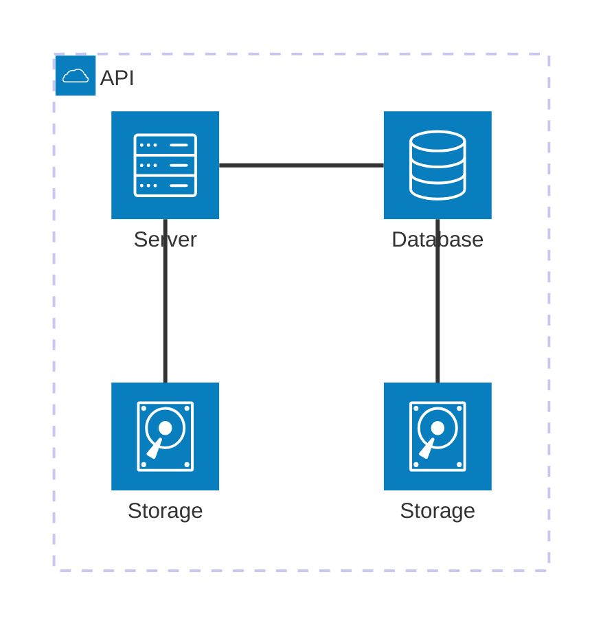
```mermaid
architecture-beta
    group api(cloud)[API]

    service db(database)[Database] in api
    service disk1(disk)[Storage] in api
    service disk2(disk)[Storage] in api
    service server(server)[Server] in api

    db:L -- R:server
    disk1:T -- B:server
    disk2:T -- B:db

```

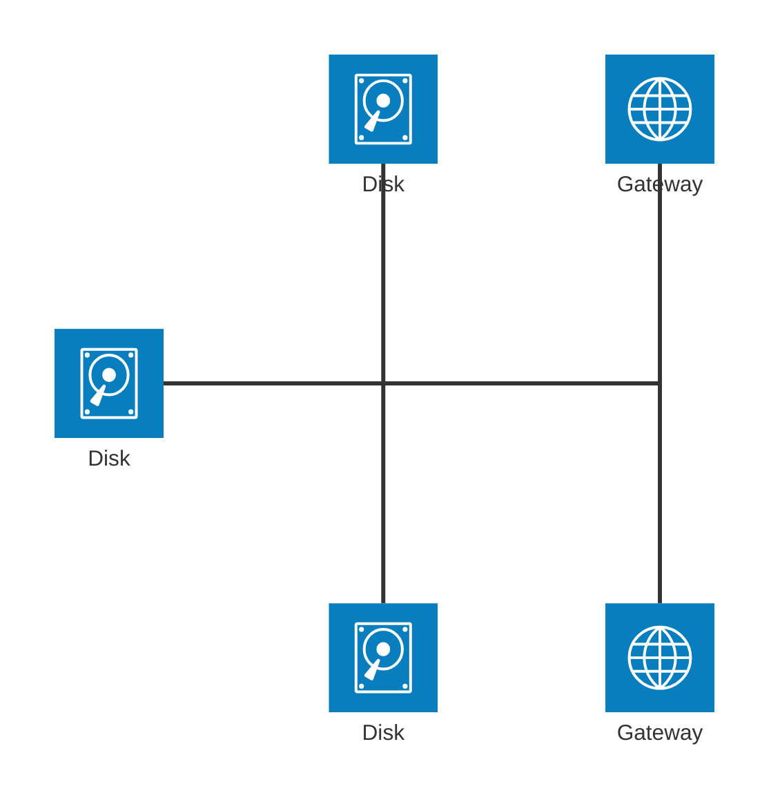
```mermaid
architecture-beta
    service left_disk(disk)[Disk]
    service top_disk(disk)[Disk]
    service bottom_disk(disk)[Disk]
    service top_gateway(internet)[Gateway]
    service bottom_gateway(internet)[Gateway]
    junction junctionCenter
    junction junctionRight

    left_disk:R -- L:junctionCenter
    top_disk:B -- T:junctionCenter
    bottom_disk:T -- B:junctionCenter
    junctionCenter:R -- L:junctionRight
    top_gateway:B -- T:junctionRight
    bottom_gateway:T -- B:junctionRight

```

### 10.15 Packet

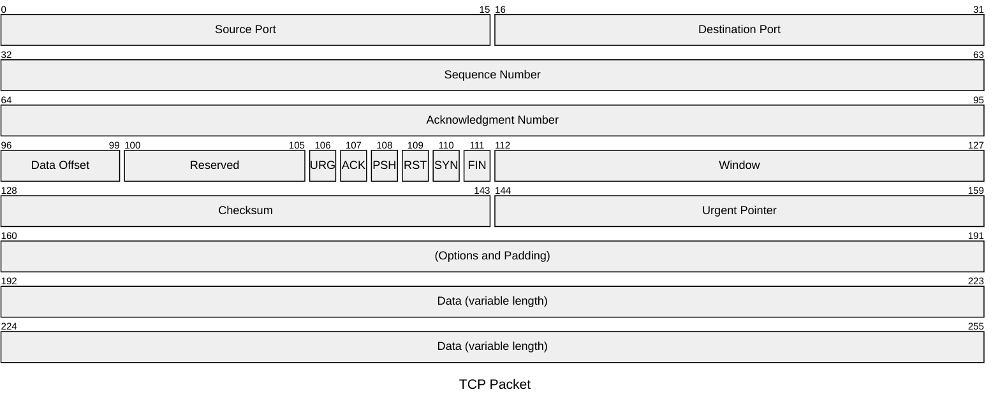
```mermaid
---
title: "TCP Packet"
---
packet-beta
0-15: "Source Port"
16-31: "Destination Port"
32-63: "Sequence Number"
64-95: "Acknowledgment Number"
96-99: "Data Offset"
100-105: "Reserved"
106: "URG"
107: "ACK"
108: "PSH"
109: "RST"
110: "SYN"
111: "FIN"
112-127: "Window"
128-143: "Checksum"
144-159: "Urgent Pointer"
160-191: "(Options and Padding)"
192-255: "Data (variable length)"

```

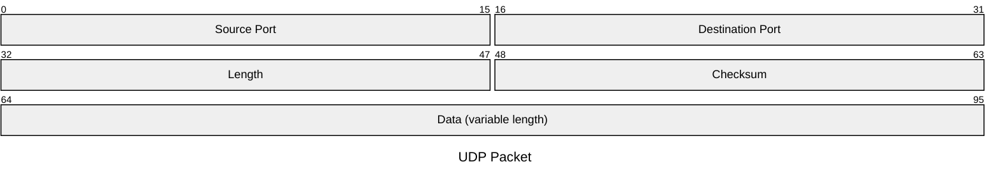
```mermaid
packet-beta
title UDP Packet
+16: "Source Port"
+16: "Destination Port"
32-47: "Length"
48-63: "Checksum"
64-95: "Data (variable length)"

```

### 10.16 Block Diagrams Documentation

```mermaid
block-beta
columns 1
  db(("DB"))
  blockArrowId6&lt;["&nbsp;&nbsp;&nbsp;"]>(down)
  block:ID
    A
    B["A wide one in the middle"]
    C
  end
  space
  D
  ID --> D
  C --> D
  style B fill:#969,stroke:#333,stroke-width:4px

```

### 10.17 x-y chart

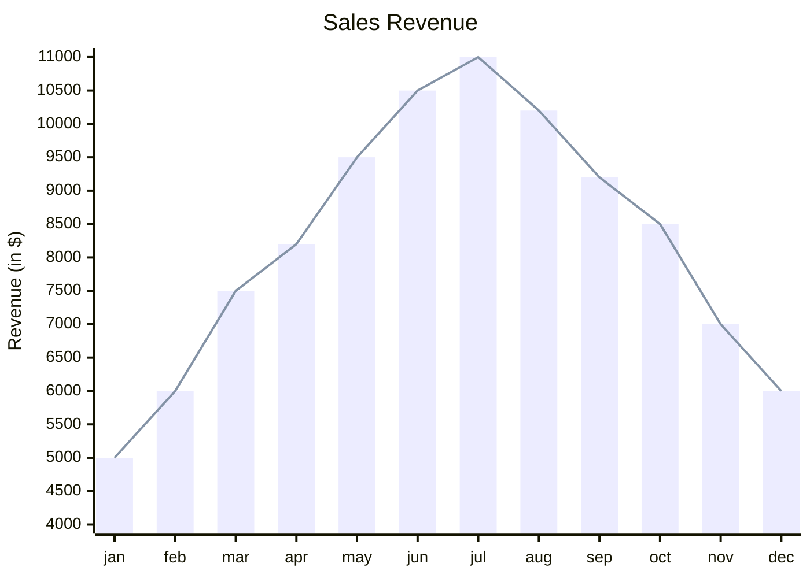
```mermaid
xychart-beta
    title "Sales Revenue"
    x-axis [jan, feb, mar, apr, may, jun, jul, aug, sep, oct, nov, dec]
    y-axis "Revenue (in $)" 4000 --> 11000
    bar [5000, 6000, 7500, 8200, 9500, 10500, 11000, 10200, 9200, 8500, 7000, 6000]
    line [5000, 6000, 7500, 8200, 9500, 10500, 11000, 10200, 9200, 8500, 7000, 6000]

```

### 10.18 Sankey diagram

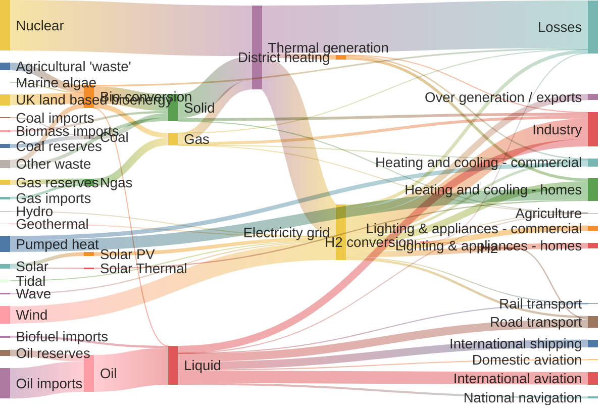
```mermaid
---
config:
  sankey:
    showValues: false
---
sankey-beta

Agricultural 'waste',Bio-conversion,124.729
Bio-conversion,Liquid,0.597
Bio-conversion,Losses,26.862
Bio-conversion,Solid,280.322
Bio-conversion,Gas,81.144
Biofuel imports,Liquid,35
Biomass imports,Solid,35
Coal imports,Coal,11.606
Coal reserves,Coal,63.965
Coal,Solid,75.571
District heating,Industry,10.639
District heating,Heating and cooling - commercial,22.505
District heating,Heating and cooling - homes,46.184
Electricity grid,Over generation / exports,104.453
Electricity grid,Heating and cooling - homes,113.726
Electricity grid,H2 conversion,27.14
Electricity grid,Industry,342.165
Electricity grid,Road transport,37.797
Electricity grid,Agriculture,4.412
Electricity grid,Heating and cooling - commercial,40.858
Electricity grid,Losses,56.691
Electricity grid,Rail transport,7.863
Electricity grid,Lighting & appliances - commercial,90.008
Electricity grid,Lighting & appliances - homes,93.494
Gas imports,Ngas,40.719
Gas reserves,Ngas,82.233
Gas,Heating and cooling - commercial,0.129
Gas,Losses,1.401
Gas,Thermal generation,151.891
Gas,Agriculture,2.096
Gas,Industry,48.58
Geothermal,Electricity grid,7.013
H2 conversion,H2,20.897
H2 conversion,Losses,6.242
H2,Road transport,20.897
Hydro,Electricity grid,6.995
Liquid,Industry,121.066
Liquid,International shipping,128.69
Liquid,Road transport,135.835
Liquid,Domestic aviation,14.458
Liquid,International aviation,206.267
Liquid,Agriculture,3.64
Liquid,National navigation,33.218
Liquid,Rail transport,4.413
Marine algae,Bio-conversion,4.375
Ngas,Gas,122.952
Nuclear,Thermal generation,839.978
Oil imports,Oil,504.287
Oil reserves,Oil,107.703
Oil,Liquid,611.99
Other waste,Solid,56.587
Other waste,Bio-conversion,77.81
Pumped heat,Heating and cooling - homes,193.026
Pumped heat,Heating and cooling - commercial,70.672
Solar PV,Electricity grid,59.901
Solar Thermal,Heating and cooling - homes,19.263
Solar,Solar Thermal,19.263
Solar,Solar PV,59.901
Solid,Agriculture,0.882
Solid,Thermal generation,400.12
Solid,Industry,46.477
Thermal generation,Electricity grid,525.531
Thermal generation,Losses,787.129
Thermal generation,District heating,79.329
Tidal,Electricity grid,9.452
UK land based bioenergy,Bio-conversion,182.01
Wave,Electricity grid,19.013
Wind,Electricity grid,289.366

```

```mermaid
sankey-beta

%% source,target,value
Electricity grid,Over generation / exports,104.453
Electricity grid,Heating and cooling - homes,113.726
Electricity grid,H2 conversion,27.14

```

```mermaid
sankey-beta

Bio-conversion,Losses,26.862

Bio-conversion,Solid,280.322

Bio-conversion,Gas,81.144

```

```mermaid
sankey-beta

Pumped heat,"Heating and cooling, ""homes""",193.026
Pumped heat,"Heating and cooling, ""commercial""",70.672

```

### 10.19 timeline

```mermaid
timeline
    title History of Social Media Platform
    2002 : LinkedIn
    2004 : Facebook
         : Google
    2005 : YouTube
    2006 : Twitter


```

```mermaid
timeline
    title Timeline of Industrial Revolution
    section 17th-20th century
        Industry 1.0 : Machinery, Water power, Steam &lt;br>power
        Industry 2.0 : Electricity, Internal combustion engine, Mass production
        Industry 3.0 : Electronics, Computers, Automation
    section 21st century
        Industry 4.0 : Internet, Robotics, Internet of Things
        Industry 5.0 : Artificial intelligence, Big data, 3D printing

```

### 10.20 Git diagrams

```mermaid
---
title: Example Git diagram
---
gitGraph
   commit
   commit
   branch develop
   checkout develop
   commit
   commit
   checkout main
   merge develop
   commit
   commit

```

```mermaid
    gitGraph
       commit
       commit
       commit

```

```mermaid
    gitGraph
       commit id: "Alpha"
       commit id: "Beta"
       commit id: "Gamma"

```

```mermaid
    gitGraph
       commit id: "Normal"
       commit
       commit id: "Reverse" type: REVERSE
       commit
       commit id: "Highlight" type: HIGHLIGHT
       commit


```

```mermaid
    gitGraph
       commit id: "1"
       commit id: "2"
       branch nice_feature
       checkout nice_feature
       commit id: "3"
       checkout main
       commit id: "4"
       checkout nice_feature
       branch very_nice_feature
       checkout very_nice_feature
       commit id: "5"
       checkout main
       commit id: "6"
       checkout nice_feature
       commit id: "7"
       checkout main
       merge nice_feature id: "customID" tag: "customTag" type: REVERSE
       checkout very_nice_feature
       commit id: "8"
       checkout main
       commit id: "9"

```

```mermaid
---
config:
  logLevel: 'debug'
  theme: 'base'
  gitGraph:
    showBranches: false
---
      gitGraph
        commit
        branch hotfix
        checkout hotfix
        commit
        branch develop
        checkout develop
        commit id:"ash" tag:"abc"
        branch featureB
        checkout featureB
        commit type:HIGHLIGHT
        checkout main
        checkout hotfix
        commit type:NORMAL
        checkout develop
        commit type:REVERSE
        checkout featureB
        commit
        checkout main
        merge hotfix
        checkout featureB
        commit
        checkout develop
        branch featureA
        commit
        checkout develop
        merge hotfix
        checkout featureA
        commit
        checkout featureB
        commit
        checkout develop
        merge featureA
        branch release
        checkout release
        commit
        checkout main
        commit
        checkout release
        merge main
        checkout develop
        merge release

```

### 10.21 Requirement Diagram

```mermaid
    requirementDiagram

    requirement test_req {
    id: 1
    text: the test text.
    risk: high
    verifymethod: test
    }

    functionalRequirement test_req2 {
    id: 1.1
    text: the second test text.
    risk: low
    verifymethod: inspection
    }

    performanceRequirement test_req3 {
    id: 1.2
    text: the third test text.
    risk: medium
    verifymethod: demonstration
    }

    interfaceRequirement test_req4 {
    id: 1.2.1
    text: the fourth test text.
    risk: medium
    verifymethod: analysis
    }

    physicalRequirement test_req5 {
    id: 1.2.2
    text: the fifth test text.
    risk: medium
    verifymethod: analysis
    }

    designConstraint test_req6 {
    id: 1.2.3
    text: the sixth test text.
    risk: medium
    verifymethod: analysis
    }

    element test_entity {
    type: simulation
    }

    element test_entity2 {
    type: word doc
    docRef: reqs/test_entity
    }

    element test_entity3 {
    type: "test suite"
    docRef: github.com/all_the_tests
    }


    test_entity - satisfies -> test_req2
    test_req - traces -> test_req2
    test_req - contains -> test_req3
    test_req3 - contains -> test_req4
    test_req4 - derives -> test_req5
    test_req5 - refines -> test_req6
    test_entity3 - verifies -> test_req5
    test_req &lt;- copies - test_entity2

```

### 10.22 State Diagram

```mermaid
---
title: Simple sample
---
stateDiagram-v2
    [*] --> Still
    Still --> [*]

    Still --> Moving
    Moving --> Still
    Moving --> Crash
    Crash --> [*]

```

```mermaid
stateDiagram-v2
    [*] --> First
    First --> Second
    First --> Third

    state First {
        [*] --> fir
        fir --> [*]
    }
    state Second {
        [*] --> sec
        sec --> [*]
    }
    state Third {
        [*] --> thi
        thi --> [*]
    }

```

### 10.23 State Diagram

```mermaid
---
title: Simple sample
---
stateDiagram-v2
    [*] --> Still
    Still --> [*]

    Still --> Moving
    Moving --> Still
    Moving --> Crash
    Crash --> [*]

```

### 10.24 Entity Relationship Diagrams

```mermaid
erDiagram
    CUSTOMER ||--o{ ORDER : places
    CUSTOMER {
        string name
        string custNumber
        string sector
    }
    ORDER ||--|{ LINE-ITEM : contains
    ORDER {
        int orderNumber
        string deliveryAddress
    }
    LINE-ITEM {
        string productCode
        int quantity
        float pricePerUnit
    }

```


## 10A. 内嵌图表（```chart）

> Guaxi 扩展语法。图表用 ECharts 渲染，支持「查看 / 导出 SVG / 导出 PNG」。
> 数据可内联，也可指向任意本地文件（相对笔记目录、绝对路径、或 `~/` 开头的用户目录）。

### 10A.1 最小示例（内联数据）

```chart
spec:
  type: line
  x: day
  y: [visitors]
data: |
  day,visitors
  周一,120
  周二,180
  周三,160
```

### 10A.2 柱状图 + 多序列 + 标题

`y` 写成数组即为多序列，自动出现图例。

```chart
spec:
  type: bar
  x: month
  y: [revenue, cost]
  title: 季度营收对比
data: |
  month,revenue,cost
  一月,120,40
  二月,180,60
  三月,160,55
```

### 10A.3 面积图

`type: area` 等价于折线图加填充。`smooth: true` 可开启平滑曲线。

```chart
spec:
  type: area
  x: week
  y: [orders]
  smooth: true
data: |
  week,orders
  W1,32
  W2,45
  W3,38
  W4,61
```

### 10A.4 饼图 / 环形图

`pie` 为实心饼图，`doughnut` 为环形。取 `x` 列作名称、`y` 第一个字段作数值。

```chart
spec:
  type: donut
  x: channel
  y: [share]
  title: 渠道占比
data: |
  channel,share
  自然搜索,42
  直接访问,28
  社交媒体,18
  其它,12
```

### 10A.5 散点图

`y` 给两个字段时，分别作为 x / y 坐标。`symbolSize` 控制点大小。

```chart
spec:
  type: scatter
  y: [height, weight]
  symbolSize: 14
data: |
  height,weight
  160,52
  168,60
  172,66
  178,72
  183,80
```

### 10A.6 数据来自外部文件

`data` 指向文件路径时，支持三种写法：

| 写法 | 含义 | 示例 |
| --- | --- | --- |
| 相对路径 | 相对**当前笔记所在目录** | `./data/sales.csv`、`../shared/x.csv` |
| 绝对路径 | 系统任意位置 | `D:/datasets/sales.csv` |
| 用户目录 | 以 `~/` 开头 | `~/datasets/sales.csv` |

支持 `.csv` / `.tsv` / `.json` 三种格式。

```chart
spec:
  type: line
  x: date
  y: [close]
  title: 收盘价
data: ./data/stock.csv
```

### 10A.7 数据来自 JSON 文件

JSON 支持三种形态：顶层数组、`{"data": [...]}`、`{"rows": [...]}`。

```chart
spec:
  type: bar
  x: name
  y: [score]
data: |
  [
    { "name": "甲", "score": 88 },
    { "name": "乙", "score": 92 },
    { "name": "丙", "score": 75 }
  ]
```

### 10A.8 TSV 数据

用制表符分隔时自动识别（也可在文件名上用 `.tsv`）。

```chart
spec:
  type: bar
  x: item
  y: [count]
data: |
  item	count
  苹果	12
  香蕉	7
  橙子	9
```

### 10A.9 直接写完整 ECharts option

不想记简化语法时，可以把整个 option 作为 JSON 写进围栏，完全掌控样式。

```chart
{
  "title": { "text": "自定义配色" },
  "xAxis": { "type": "category", "data": ["A", "B", "C"] },
  "yAxis": { "type": "value" },
  "series": [
    { "type": "bar", "data": [5, 20, 36], "itemStyle": { "color": "#5470c6" } }
  ]
}
```

### 10A.10 全部支持的图表类型

| 族 | type | 说明 |
| --- | --- | --- |
| 趋势 | `line` | 折线。`smooth` 平滑、`step` 阶梯、`areaStyle` 面积填充 |
| 趋势 | `area` | 等同 `line` + 填充 |
| 对比 | `bar` | 柱状/条形。`stack` 堆叠、`orient: horizontal` 横向、`showBackground` 背景条 |
| 对比 | `waterfall` | 瀑布图（由增量推累计，`total: true` 显示合计） |
| 对比 | `pictorialbar` | 象形柱图（`symbol` 指定图形） |
| 占比 | `pie` / `doughnut` / `ring` | 饼图/环形。`roseType: angle` 南丁格尔玫瑰 |
| 分布 | `scatter` | 散点。`size` 指定第三维映射到点大小 |
| 分布 | `effectscatter` | 带涟漪动画的散点 |
| 分布 | `boxplot` | 箱线图。`fields` 给五数，或让库自动计算 |
| 分布 | `heatmap` | 热力图（矩阵形式，带 visualMap） |
| 多维 | `radar` | 雷达图 |
| 多维 | `parallel` | 平行坐标系 |
| 流向 | `sankey` | 桑基图。`source`/`target`/`value` 三列 |
| 转化 | `funnel` | 漏斗图（默认降序） |
| 指标 | `gauge` | 仪表盘。单行数据=单环；多行=多环 |
| 层级 | `tree` | 树图。`path` 列用 `/` 分隔层级 |
| 层级 | `treemap` | 矩形树图 |
| 层级 | `sunburst` | 旭日图 |
| 关系 | `graph` | 关系图。`source`/`target` 两列 |
| 地理 | `map` | 地图（需 `map` 指定已注册的 GeoJSON 名） |
| 地理 | `lines` | 路径图（四列坐标） |
| 金融 | `candlestick` | K 线（`fields: [open, close, low, high]`） |
| 统计 | `themeriver` | 主题河流图（`[时间, 值, 主题]` 三列） |
| 万能 | `custom` | 自定义。`variant: gantt` 画甘特图，`variant: bullet` 画子弹图 |
| 扩展 | `liquidfill` | 水球图（ECHarts 扩展包，按需加载） |
| 扩展 | `wordcloud` | 词云（扩展包，按需加载） |

**别名**：`kline`→candlestick、`donut`→doughnut、`bubble`→scatter、`violin`→boxplot、
`liquid`→liquidfill、`network`→graph、`waterful`→waterfall。

### 10A.11 各类型示例

#### 堆叠柱状 + 背景条

```chart
spec:
  type: bar
  x: month
  y: [online, offline]
  stack: true
  showBackground: true
  title: 渠道对比
data: |
  month,online,offline
  一月,120,80
  二月,160,90
  三月,140,70
```

#### 瀑布图

```chart
spec:
  type: waterfall
  x: item
  y: [delta]
  total: true
  title: 收入构成
data: |
  item,delta
  期初,100
  新增,40
  流失,-25
  退款,-10
```

#### 雷达图

```chart
spec:
  type: radar
  x: name
  y: [速度, 稳定性, 易用性, 成本]
data: |
  name,速度,稳定性,易用性,成本
  方案A,90,70,85,60
  方案B,75,88,70,80
```

#### 桑基图

```chart
spec:
  type: sankey
  x: source
  y: [target, value]
  title: 流量去向
data: |
  source,target,value
  首页,列表,60
  首页,详情,40
  列表,详情,45
  详情,下单,35
```

#### 仪表盘（单值）

```chart
spec:
  type: gauge
  y: [value]
  max: 100
  formatter: '{value}%'
data: |
  value
  78
```

#### 仪表盘（多环）

```chart
spec:
  type: gauge
  x: name
  y: [value]
  max: 100
data: |
  name,value
  CPU,62
  内存,78
  磁盘,45
```

#### 漏斗图

```chart
spec:
  type: funnel
  x: stage
  y: [count]
  title: 转化漏斗
data: |
  stage,count
  曝光,1000
  点击,420
  加购,180
  下单,96
```

#### 树图（组织架构）

```chart
spec:
  type: tree
  path: path
  y: [value]
  orient: LR
data: |
  path,value
  总公司/研发部/前端,20
  总公司/研发部/后端,30
  总公司/产品部,15
  分公司/销售部,25
```

#### 旭日图

```chart
spec:
  type: sunburst
  path: path
  y: [value]
data: |
  path,value
  技术/前端,30
  技术/后端,50
  产品,20
```

#### 关系图

```chart
spec:
  type: graph
  x: source
  y: [target, weight]
  layout: force
data: |
  source,target,weight
  笔记A,笔记B,2
  笔记B,笔记C,1
  笔记C,笔记A,3
```

#### 热力图（矩阵）

```chart
spec:
  type: heatmap
  x: day
  y: [hour, value]
  title: 访问热力
data: |
  day,hour,value
  周一,9,12
  周一,14,30
  周二,9,18
  周二,14,42
```

#### K 线

```chart
spec:
  type: candlestick
  x: date
  fields: [open, close, low, high]
data: |
  date,open,close,low,high
  10-01,100,110,98,112
  10-02,110,105,102,113
  10-03,105,118,104,120
```

#### 甘特图

```chart
spec:
  type: custom
  variant: gantt
  x: task
  y: [start, end]
data: |
  task,start,end
  需求,0,3
  设计,2,5
  开发,4,12
  测试,10,15
```

#### 象形柱图

```chart
spec:
  type: pictorialbar
  x: month
  y: [score]
  symbol: circle
data: |
  month,score
  一月,120
  二月,180
  三月,160
```

#### 水球图（扩展包）

```chart
spec:
  type: liquidfill
  y: [value]
  max: 100
  formatter: '完成 {c}%'
data: |
  value
  68
```

#### 词云（扩展包）

```chart
spec:
  type: wordcloud
  x: word
  y: [weight]
  sizeRange: [14, 56]
data: |
  word,weight
  知识管理,90
  笔记,80
  检索,70
  复盘,60
  阅读,55
```

#### 数据放在资源库（跨机器可用的写法）

把数据文件固化进资源库后，用 `resource:` 引用库内副本：

```chart
spec:
  type: bar
  x: month
  y: [revenue, cost]
  title: 季度营收对比
data: resource:charts/2026/10/sales.csv
```

编辑器工具栏的「图表」按钮会自动完成「复制进资源库 → 插入这段围栏」。

三种引用写法的区别：

| 写法 | 示例 | 数据文件被挪走 / 换机器时 |
| --- | --- | --- |
| 资源库 | `resource:charts/2026/10/sales.csv` | 只要资源库同步到位就能继续渲染 |
| 相对笔记 | `./data/sales.csv` | 读不到时回退到资源库同名路径 |
| 绝对路径 | `D:/datasets/sales.csv` | 换机器必然失效，仅本机临时使用 |

### 10A.12 语法速查

| 字段 | 取值 | 说明 |
| --- | --- | --- |
| `spec.type` | 见上表 | 图表类型，缺省 `line` |
| `spec.x` | 字段名 | 横轴分类字段；饼图/漏斗等用作名称 |
| `spec.y` | 字段名或数组 | 数值字段；数组即多序列 |
| `spec.title` | 字符串 | 图表标题 |
| `spec.smooth` | 布尔 | 折线平滑 |
| `spec.step` | `start`/`middle`/`end` | 阶梯折线 |
| `spec.stack` | 布尔/字符串 | 堆叠分组名 |
| `spec.orient` | `horizontal` | 横向柱状 |
| `spec.showBackground` | 布尔 | 柱状背景条 |
| `spec.roseType` | `angle`/`radius` | 玫瑰图 |
| `spec.radius` | 字符串或数组 | 饼图半径（数组为内外径） |
| `spec.size` | 字段名 | 散点第三维（点大小） |
| `spec.fields` | 数组 | 多列图（K线/箱线/路径）的显式列名 |
| `spec.path` | 字段名 | 树/矩形树/旭日图的层级列（`/` 分隔） |
| `spec.source`/`target`/`value` | 字段名 | 桑基/关系图的列名 |
| `spec.variant` | `gantt`/`bullet` | custom 图的内置变体 |
| `spec.seriesStyle` | 对象 | 直接覆盖任意 ECharts series 字段 |
| `spec.xAxisStyle`/`yAxisStyle` | 对象 | 直接覆盖轴配置 |
| `spec.legend` | 布尔 | `false` 关闭图例 |
| `spec.tooltip` | 布尔/对象 | `false` 关闭；对象则原样使用 |
| `data` | 内联文本或路径 | 数据来源（`resource:` / 相对 / 绝对 / `~/`） |

**数据格式要求**：首行为表头，其余每行为一条记录；数值列会尽量转成数字，空单元格保留为空。CSV 支持引号包裹（引号内可含逗号与换行）。

### 10A.11 白板（```excalidraw）

```excalidraw
./assets/architecture.excalidraw
```

围栏内容为场景文件路径，规则与 `chart` 的 `data` 一致（`resource:` / 相对 / 绝对 / `~/`）。
渲染为只读 SVG，带「在其他窗口打开」按钮。


## 11. 其他元素

### 11.1 脚注
这里有一个脚注引用[1](@ref)，这里有两个脚注引用[2](@ref)。

[1](@ref): 这是第一个详细的脚注内容，可以解释前文的某些概念。
[2](@ref): 第二个脚注，可以包含**格式化文本**、`代码`或其他[链接](https://example.com)。

### 11.2 任务列表
- [x] 完成Markdown基础语法测试
- [x] 添加所有代码示例
- [x] 包含数学公式
- [ ] 测试Mermaid图表渲染
- [ ] 验证表格格式化
- [ ] 检查所有链接

### 11.3 表情符号
这是表情符号测试：🚀 ⚡ 🔥 💻 📱 🎨 📊 📈 📉 ✅ ❌ ⚠️ ℹ️

### 11.4 上标和下标
水的化学式：H~2~O
爱因斯坦质能方程：E = mc^2^
勾股定理：a^2^ + b^2^ = c^2^

## 12. 特殊字符

### 12.1 HTML实体
&lt; &gt; &amp; &copy; &reg; &trade; &nbsp; &quot; &apos; &cent; &pound; &yen; &euro; &sect;

### 12.2 转义字符
\* 星号 \_ 下划线 \` 反引号 \~ 波浪线 \# 井号 \+ 加号 \- 减号 \. 点 \( 左括号 \) 右括号 \[ 左中括号 \] 右中括号 \{ 左大括号 \} 右大括号

## 13. 扩展语法测试

### 13.1 目录（TOC）
[TOC]

### 13.2 注音符号
Markdown: 标记{márkdəʊn}语言
中文: 中文{zhōngwén}

### 13.3 下标和上标
H~2~O
x^2^ + y^2^ = z^2^

## 14. 综合测试段落

这是一个**综合性测试段落**，包含了*多种* Markdown 元素。例如，这里有`行内代码`，有[链接](https://example.com)，有**加粗**和*斜体*，还有~~删除线~~。

> 这是一个引用块，内部也可以包含**格式化文本**和`代码`。

列表测试：
- 第一项包含`代码`
- 第二项包含**粗体**
- 第三项包含*斜体*

表格测试：

| 功能 | 状态 | 测试日期 |
|------|------|----------|
| 标题 | ✅ | 2024-01-01 |
| 列表 | ✅ | 2024-01-01 |
| 代码块 | ✅ | 2024-01-01 |
| 表格 | ⚠️ | 2024-01-01 |
| 数学公式 | ❌ | 2024-01-01 |

数学公式行内测试：$f(x) = \int_{-\infty}^{\infty} \hat{f}(\xi) e^{2 \pi i \xi x} d\xi$

代码块测试：
```javascript
// JavaScript示例
console.log("Hello, World!");
```

## 15. 复杂表格示例

| 项目 | 描述 | 状态 | 进度 | 负责人 | 截止日期 |
|------|------|------|------|--------|----------|
| 用户认证 | 实现OAuth 2.0和JWT | 🔄 进行中 | 75% | 张三 | 2024-02-15 |
| 支付集成 | 集成Stripe和PayPal | ✅ 完成 | 100% | 李四 | 2024-01-30 |
| 性能优化 | 数据库查询优化 | ⏳ 计划中 | 0% | 王五 | 2024-03-01 |
| 移动端适配 | 响应式设计改进 | 🔄 进行中 | 60% | 赵六 | 2024-02-28 |
| 文档编写 | API文档和用户手册 | 🚫 阻塞 | 30% | 钱七 | 2024-02-20 |

## 16. 测试数据

### 16.1 长文本测试
Lorem ipsum dolor sit amet, consectetur adipiscing elit. Sed do eiusmod tempor incididunt ut labore et dolore magna aliqua. Ut enim ad minim veniam, quis nostrud exercitation ullamco laboris nisi ut aliquip ex ea commodo consequat. Duis aute irure dolor in reprehenderit in voluptate velit esse cillum dolore eu fugiat nulla pariatur. Excepteur sint occaecat cupidatat non proident, sunt in culpa qui officia deserunt mollit anim id est laborum.

### 16.2 混合内容测试
这是一个**混合内容**的段落，包含：
1. 有序列表项
2. 另一个列表项
   - 嵌套无序列表
   - 更多嵌套
3. 回到有序列表

> 引用中的**混合内容**：
> 1. 引用中的有序列表
> 2. 继续
>   - 嵌套
>   - 更多

`行内代码`在段落中，还有数学公式：$a^2 + b^2 = c^2$

| 表头1 | 表头2 |
|-------|-------|
| 单元格1 | 单元格2 |

## 17. 结束语

这个文档包含了**所有主要的Markdown语法**，包括：

1. **基础语法**：标题、强调、列表、链接、图片
2. **扩展语法**：表格、任务列表、脚注、定义列表
3. **代码块**：多种编程语言
4. **数学公式**：行内和块级公式
5. **Mermaid图表**：所有图表类型
6. **特殊字符和格式**：上标、下标、转义字符

测试完成后，请检查以下方面：
- [ ] 所有标题是否正确渲染
- [ ] 列表嵌套是否正确
- [ ] 代码高亮是否正常
- [ ] 表格边框和对齐
- [ ] 数学公式渲染
- [ ] Mermaid图表显示
- [ ] 链接和图片加载
- [ ] 引用块格式
- [ ] 特殊字符处理

---

*测试文档结束*